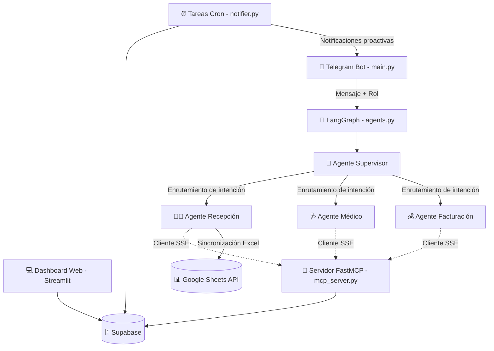

# 🦷 AutomaDent — Sistema Multiagente para Clínica Dental

[](https://github.com/modelcontextprotocol)
[](https://github.com/langchain-ai/langgraph)
[](https://supabase.com)
[](https://streamlit.io)
[](https://www.docker.com)

**AutomaDent** es un Sistema Multiagente (SMA) con arquitectura **Hub-and-Spoke** diseñado para automatizar y optimizar la gestión operativa de una clínica dental. Combina un **Bot de Telegram** inteligente impulsado por IA, un **servidor de datos desacoplado basado en MCP (Model Context Protocol)** y un **Dashboard Administrativo Web** construido en Streamlit.

El sistema cuenta con soporte de empaquetado nativo mediante **Docker Compose**, lo que facilita su despliegue en la nube (como droplets de DigitalOcean) integrado con túneles Cloudflare Zero Trust.

---

## 🏗️ Arquitectura del Sistema

La arquitectura de AutomaDent desacopla el cliente del bot de la lógica del servidor de base de datos a través del protocolo **MCP (Model Context Protocol)**. Las herramientas CRUD de base de datos se exponen sobre Server-Sent Events (SSE), permitiendo que cualquier cliente compatible con MCP (incluyendo bots e IAs) consuma los servicios de forma centralizada y segura.



---

## 📂 Estructura del Proyecto

El repositorio está organizado con los siguientes componentes de software:

| Archivo / Carpeta | Tecnología | Rol y Responsabilidad |
| :--- | :--- | :--- |
| **`mcp_server.py`** | `FastMCP`, `Supabase` | **Servidor MCP de Datos**. Expone las operaciones CRUD de base de datos como herramientas de IA (`@mcp.tool()`) accesibles por red (puerto `8001`) sobre SSE. |
| **`agents.py`** | `LangGraph`, `Gemini` | **Cerebro Multiagente**. Modela los nodos de decisión (Supervisor, Recepción, Médico, Facturación) e inyecta dinámicamente las herramientas del servidor MCP. |
| **`main.py`** | `python-telegram-bot` | **Bot de Telegram**. Inicializa el cliente MCP y el bot. Al recibir un mensaje, identifica el rol del usuario en la BD y delega el mensaje al flujo de LangGraph. |
| **`dashboard.py`** | `Streamlit`, `Plotly` | **Dashboard Administrativo**. Aplicación web tradicional expuesta en el puerto `8502` para gestionar personal, pacientes, historial clínico y finanzas visualmente. |
| **`notifier.py`** | `Python`, `Telegram API` | **Servicio de Recordatorios (Cron)**. Ejecuta tareas planificadas diarias para recordar citas a los pacientes y reportar la agenda diaria a los odontólogos. |
| **`database.py`** | `Supabase SDK` | **Cliente Supabase Base**. Centraliza la inicialización de base de datos para funcionalidades locales como la memoria a largo plazo (`mensajes_chat`). |
| **`tools.py`** | `gspread`, `Google Auth` | **Herramientas Legacy**. Mantiene la exportación en tiempo real a Google Sheets mediante `credentials.json`. |
| **`schema.sql`** | `PostgreSQL` | **Esquema Relacional**. Sentencias SQL de creación de tablas, relaciones, enums e índices en Supabase. |
| **`doc/`** | `Markdown` | **Carpeta de Documentación**. Contiene guías a fondo de la arquitectura, APIs, integraciones y roles de usuario. |

---

## 🔒 Control de Acceso Basado en Roles (RBAC)

El bot y el servidor validan automáticamente la identidad de quien escribe en Telegram comparando su ID de chat (`chat_id`) en la base de datos de Supabase:

1. **Pacientes**: Su `chat_id` debe registrarse en la tabla `pacientes` (columna `telefono`). Tienen acceso exclusivamente a ver su historial clínico, gestionar y agendar sus propias citas.
2. **Personal Clínico**: Su `chat_id` debe registrarse en la tabla `personal` (columna `telefono`) junto a su rol administrativo/clínico (`rol_personal`):
   - **`odontologo`**: Puede ver historiales clínicos y registrar diagnósticos y evoluciones en las citas médicas asignadas.
   - **`recepcionista`**: Puede gestionar la agenda de todos los médicos, registrar pagos de citas y exportar reportes.
   - **`administrador`**: Posee acceso completo, incluyendo la administración de personal y visualización financiera.

> [!IMPORTANT]
> **Seguridad End-to-End**: A diferencia de arquitecturas tradicionales donde el bot controla la seguridad, en AutomaDent el servidor MCP (`mcp_server.py`) valida los privilegios del parámetro `user_role` enviado en cada herramienta. Si un usuario no posee los permisos adecuados, la operación es denegada a nivel de base de datos.

---

## ⚙️ Configuración y Variables de Entorno

### 1. Variables de Entorno (`.env`)
Crea un archivo `.env` en la raíz del proyecto con la siguiente estructura:

```env
# Bot de Telegram e IA
TELEGRAM_BOT_TOKEN="tu_token_de_telegram"
GEMINI_API_KEY="tu_api_key_de_gemini"

# Conexión Directa a Supabase
SUPABASE_URL="https://tu-proyecto.supabase.co"
SUPABASE_SERVICE_KEY="tu_service_role_key_de_supabase"

# Endpoint de Comunicación del Servidor MCP
# Local: http://localhost:8001/mcp
# Docker: http://mcp-server:8001/sse
MCP_SERVER_URL="http://localhost:8001/mcp"
```

### 2. Cuenta de Servicio de Google (`credentials.json`)
Para habilitar la sincronización en la nube con Google Sheets, genera un archivo de clave de cuenta de servicio desde la consola de Google Cloud Platform y guárdalo como `credentials.json` en la raíz de este proyecto.

> [!WARNING]
> Nunca incluyas tu archivo `.env` o `credentials.json` en confirmaciones (commits) de Git. Ambos archivos se encuentran explícitamente ignorados en `.gitignore`.

---

## 🐳 Despliegue con Docker Compose (Producción / DigitalOcean)

El proyecto incluye una configuración multi-contenedor mediante Docker Compose lista para producción.

### Red de Túnel Cloudflare (Zero Trust)
La configuración del archivo `compose.yml` está diseñada para acoplarse con un contenedor de túnel Cloudflare que reside en el mismo host bajo la red externa `general-network`. De esta forma, el dashboard de Streamlit y el bot de Telegram se comunican internamente de forma aislada.

> [!NOTE]
> Crea la red de Docker externa antes de arrancar los servicios por primera vez si no la has inicializado aún en tu servidor:
> ```bash
> docker network create general-network
> ```

### Configuración del Servidor Remoto (Droplet)
1. Conéctate a tu droplet a través de SSH.
2. Copia tus archivos de configuración locales de forma segura al servidor (por ejemplo, usando `scp` o SFTP):
   ```bash
   scp .env credentials.json usuario@ip_de_tu_droplet:/ruta/a/tu/proyecto
   ```
3. Levanta la infraestructura con Docker Compose:
   ```bash
   # Construir e iniciar en segundo plano (detached mode)
   docker compose up -d --build
   ```

### Comandos Útiles de Administración en Producción:
* **Verificar el estado de los contenedores**: `docker compose ps`
* **Ver registros en tiempo real**: `docker compose logs -f`
* **Ver logs de un contenedor específico (ej. bot)**: `docker compose logs -f bot`
* **Detener los servicios**: `docker compose down`

---

## 🛠️ Ejecución para Desarrollo Local

Para desarrollo, depuración o pruebas locales de forma modular:

### 1. Entorno Virtual
```bash
# Crear y activar entorno virtual
python -m venv venv
venv\Scripts\activate # En Windows
source venv/bin/activate # En macOS/Linux

# Instalar dependencias
pip install -r requirements.txt
```

### 2. Iniciar el Servidor MCP (Puerto 8001)
```bash
python mcp_server.py
```
*Esto iniciará el backend FastMCP en `http://localhost:8001/mcp` mapeando todas las herramientas SQL.*

### 3. Iniciar el Bot de Telegram
Asegúrate de tener corriendo el servidor MCP primero. El bot se acoplará y registrará dinámicamente las herramientas:
```bash
python main.py
```

### 4. Iniciar el Dashboard Administrativo (Streamlit)
```bash
streamlit run dashboard.py
```
*Por defecto Streamlit se iniciará en `http://localhost:8501`. La contraseña de acceso administrativo por defecto está establecida como `dent123`.*

### 5. Probar Envío de Recordatorios
```bash
python notifier.py
```
