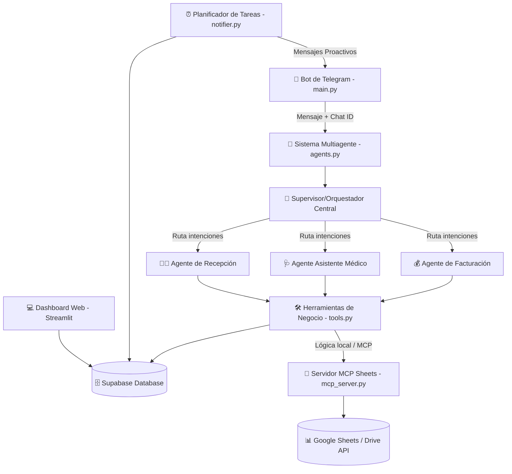
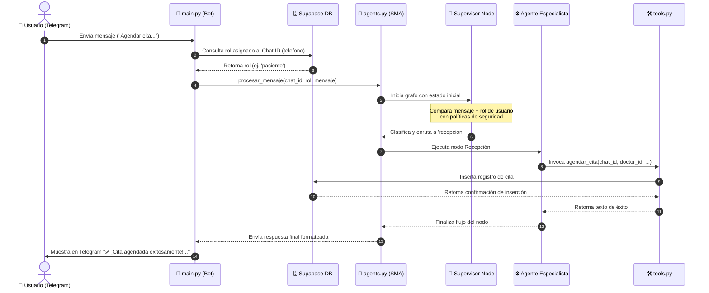
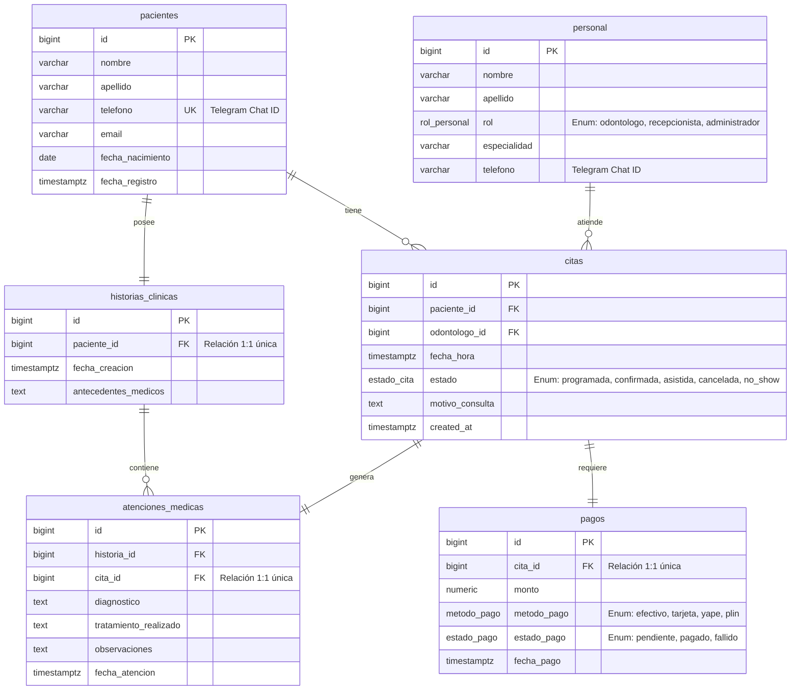

# 🦷 Arquitectura del Proyecto: Sistema Multiagente AutomaDent

Este documento detalla la arquitectura del software, los flujos de comunicación, el modelo de datos y los componentes tecnológicos que integran el **Sistema Multiagente para la Clínica Dental AutomaDent**.

---

## 🗺️ 1. Arquitectura General (Hub-and-Spoke con LangGraph)

El sistema se basa en un patrón de diseño **Hub-and-Spoke (Orquestador y Especialistas)** implementado mediante **LangGraph** y **LangChain**. Este diseño descentraliza la lógica del negocio en agentes expertos, mientras que un supervisor central evalúa el contexto, rol del usuario e intenciones para enrutar el flujo.



---

## 📦 2. Componentes del Proyecto

El código está estructurado de manera modular y limpia en el directorio raíz. A continuación se detallan las responsabilidades de cada componente:

| Archivo / Carpeta | Tecnología | Rol / Responsabilidad |
| :--- | :--- | :--- |
| **`main.py`** | Python + `python-telegram-bot` | **Punto de entrada del Bot**. Recibe los webhooks/polling de Telegram, realiza la traducción inicial de `chat_id` a rol de usuario en la base de datos (RBAC) y delega la respuesta al sistema multiagente. |
| **`agents.py`** | LangGraph + LangChain + Gemini | **Cerebro del SMA**. Define la topología del grafo de ejecución, prompts de personalidad, lógica del orquestador y ejecuta la inferencia de los nodos de agentes específicos. |
| **`tools.py`** | LangChain Tools | **Capa de Lógica de Negocio (CRUD)**. Contiene las funciones decoradas con `@tool` que los agentes pueden invocar. Aplica validaciones estrictas de seguridad de acuerdo al rol del usuario. |
| **`database.py`** | Python + Supabase SDK | **Cliente de Base de Datos**. Proporciona una instancia singleton segura de conexión a Supabase usando variables de entorno. |
| **`dashboard.py`** | Streamlit + Plotly | **Panel Administrativo Visual**. Permite a la clínica ver métricas diarias, gestionar el equipo dental, crear historias clínicas y monitorizar reportes financieros. |
| **`notifier.py`** | Python + Telegram HTTP API | **Notificador Proactivo**. Script automatizable diseñado para enviar agendas diarias a odontólogos (mañana) y recordatorios de confirmación a pacientes (tarde). |
| **`mcp_server.py`** | FastMCP (Model Context Protocol) | **Servidor de Integración**. Expone herramientas estándar de integración con Google Sheets y Google Drive. |
| **`schema.sql`** | SQL (PostgreSQL) | **Esquema de Base de Datos**. Definición documental de tablas, restricciones, enums e índices desplegados en Supabase. |

---

## 🚦 3. Flujo de un Mensaje (Secuencia)

Cuando un usuario interactúa con el Bot de Telegram, se ejecuta el siguiente pipeline de ejecución:



---

## 🗄️ 4. Modelo de Datos (Base de Datos)

El motor de almacenamiento es PostgreSQL hospedado en Supabase (`AgenteDent-bd`). 



### Reglas de Integridad Referencial
* **Pacientes a Historias Clínicas:** Relación estricta de uno a uno (`paciente_id` es único). Si un paciente es eliminado, su historia clínica se elimina en cascada (`ON DELETE CASCADE`).
* **Citas a Personal:** No se permite eliminar un odontólogo si tiene citas asociadas (`ON DELETE RESTRICT`) para mantener la consistencia histórica.
* **Citas a Atenciones y Pagos:** Se ligan en relaciones `1:1` mediante restricciones de unicidad para evitar dobles cobros o dobles evoluciones clínicas en una misma cita.

---

## 🔒 5. Sistema de Seguridad y RBAC (Control de Acceso)

La seguridad se implementa en dos capas:

1. **Capa Orquestadora (`agents.py`):**
   El `PROMPT_SUPERVISOR` tiene prohibido delegar intenciones administrativas o médicas a usuarios con rol `paciente` o `paciente_no_registrado`. Esto actúa como un cortafuegos a nivel de lenguaje.
2. **Capa de Herramientas (`tools.py`):**
   Cada función CRUD recibe el parámetro `user_role` de forma obligatoria y realiza un chequeo interno:
   ```python
   if user_role not in ["administrador", "recepcionista"]:
       return "❌ Acceso Denegado. Solo personal administrativo puede realizar esta acción."
   ```
   Esto asegura que, incluso si el modelo de lenguaje comete un error de enrutamiento, el código de backend bloqueará la ejecución en la base de datos.

---

## 🌐 6. Modos de Ejecución del Bot (Long Polling vs Webhook)

Para maximizar la flexibilidad en entornos locales y de producción, `main.py` soporta una configuración híbrida de arranque basada en variables de entorno:

### 1. Modo Long Polling (Predeterminado)
* **Cuándo se activa:** Si la variable `WEBHOOK_URL` **no** está definida en el archivo `.env`.
* **Cómo funciona:** El bot realiza solicitudes HTTP `getUpdates` repetidas a la API de Telegram de forma activa para verificar si hay nuevos mensajes.
* **Ventajas:** No requiere exponer puertos locales ni configurar certificados SSL (ideal para desarrollo local ágil).

### 2. Modo Webhook
* **Cuándo se activa:** Si la variable `WEBHOOK_URL` está definida en el archivo `.env`.
* **Cómo funciona:** 
  1. Al arrancar, el bot llama a `setWebhook` indicando la URL configurada.
  2. Levanta un servidor web interno en el puerto especificado por la variable `PORT` (por defecto `8000`).
  3. Telegram envía de forma proactiva cada actualización al bot como una petición HTTP POST a la ruta `https://<WEBHOOK_URL>/<TELEGRAM_TOKEN>`.
* **Ventajas:** Menor latencia, no consume ancho de banda con consultas repetitivas e ideal para entornos de producción.
* **Requisitos:** Requiere una URL pública con certificado SSL (`https://`). En desarrollo local se utiliza un túnel inverso como **ngrok** o **localtunnel** (`ngrok http 8000`).
