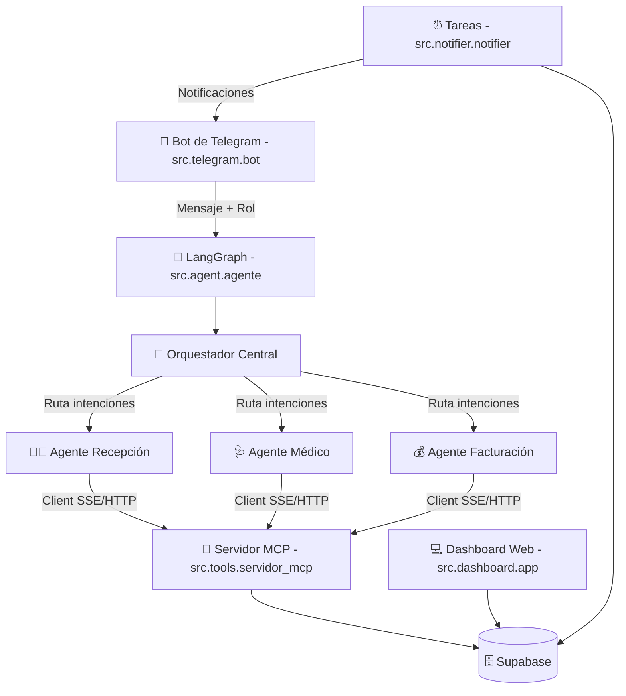
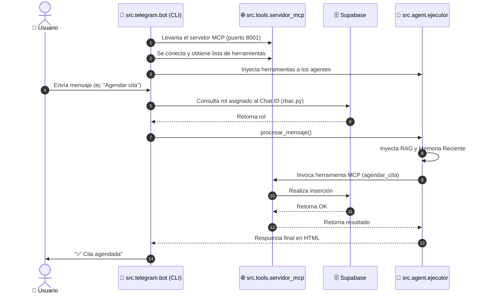

# 🦷 Arquitectura del Proyecto: Sistema Multiagente AutomaDent

Este documento detalla la arquitectura del software, los flujos de comunicación, el modelo de datos y los componentes tecnológicos que integran el **Sistema Multiagente para la Clínica Dental AutomaDent**, bajo la nueva estructura limpia, modular y centralizada en `src/`.

---

## 🗺️ 1. Arquitectura General (Hub-and-Spoke + MCP)

El sistema se basa en un patrón de diseño **Hub-and-Spoke (Orquestador y Especialistas)** implementado mediante **LangGraph** y **LangChain**. La lógica de negocio y las integraciones de base de datos están desacopladas en herramientas MCP que corre en un servidor interno expuesto vía HTTP y consumido dinámicamente por el agente principal.

---

## 📦 2. Estructura de Componentes en `src/`

La estructura modular del sistema se distribuye de la siguiente manera:

### `src/utils/`
- **`config.py`**: Centraliza todas las variables de entorno, constantes clínicas (`TIMEZONE`, `HORARIO_INICIO`, etc.) y configuraciones de modelos.
- **`database.py`**: Inicialización del cliente Supabase singleton y utilidades de almacenamiento de historial de chat, memorias y resúmenes.
- **`notificaciones.py`**: Centraliza el envío de notificaciones automáticas y alertas a pacientes u odontólogos vía API de Telegram.
- **`logger.py`**: Setup global para logs rotativos y de consola.
- **`helpers.py`**: Funciones utilitarias como sanitización de HTML y extracción de contenidos de mensajes de texto.

### `src/modelos/`
- **`cliente_llm.py`**: Construye el cliente Gemini y administra la lógica de cascada de fallback ante límites de cuota (429).
- **`embeddings.py`**: Generación de vectores de embeddings de documentos y queries para RAG.

### `src/prompts/`
- **`sistema_prompts.py`**: Contiene las plantillas de prompts para el Supervisor central y la compresión del historial.
- **`agente_prompts.py`**: Definiciones de personalidad y reglas RBAC para los agentes de Recepción, Asistente Médico y Facturación.

### `src/agent/`
- **`estado.py`**: Estructura `AgentState` de LangGraph y mapeo de herramientas permitidas por rol.
- **`agente.py`**: Construcción del grafo de LangGraph y definición de nodos.
- **`ejecutor.py`**: Orquestación del flujo del mensaje: búsqueda RAG, carga de memoria compacta, ejecución del grafo y almacenamiento del historial.
- **`memoria.py`**: Lógica de generación automática de resúmenes asíncronos en segundo plano.

### `src/tools/`
Módulos que contienen la lógica de negocio registrada como herramientas MCP (`@mcp.tool()`):
- **`recepcion.py`**: Registro de pacientes, citas e historial.
- **`medico.py`**: Evoluciones médicas y estados de citas.
- **`facturacion.py`**: Registro de pagos.
- **`administrativas.py`**: Listados de citas y personal.
- **`exportacion.py`**: Reportes en Google Sheets.
- **`servidor_mcp.py`**: Servidor FastMCP que inicializa y expone las herramientas.

### `src/telegram/`
- **`bot.py`**: Lógica principal de ejecución de Telegram, polling, handlers `/start` e inicio del subproceso del servidor MCP.
- **`rbac.py`**: Resolución de roles basada en el chat ID.

### `src/api/`
- **`app.py`**: Aplicación FastAPI principal.
- **`auth.py`**: Gestión de tokens JWT y hashing de contraseñas de personal.
- **`rutas/`**: Controladores de endpoints REST para la gestión web (`citas.py`, `pacientes.py`, `personal.py`, etc.).

---

## 🚦 3. Flujo de un Mensaje (Secuencia)

