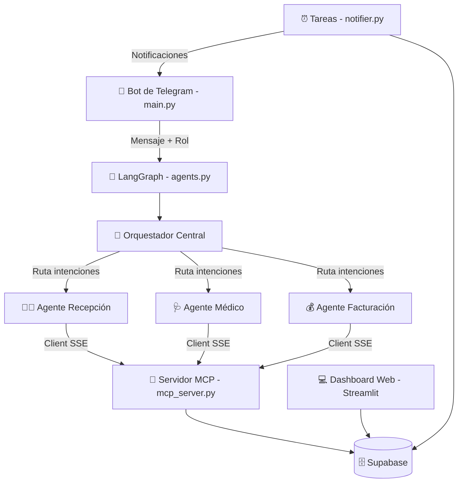
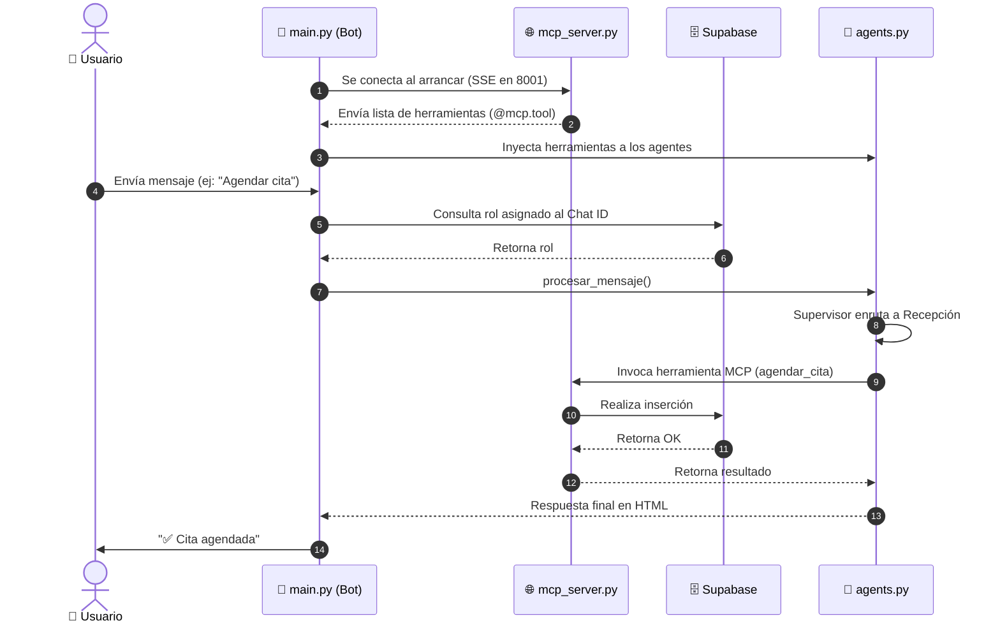

# 🦷 Arquitectura del Proyecto: Sistema Multiagente AutomaDent

Este documento detalla la arquitectura del software, los flujos de comunicación, el modelo de datos y los componentes tecnológicos que integran el **Sistema Multiagente para la Clínica Dental AutomaDent**, con especial énfasis en la reciente integración del protocolo **MCP (Model Context Protocol)**.

---

## 🗺️ 1. Arquitectura General (Hub-and-Spoke + MCP)

El sistema se basa en un patrón de diseño **Hub-and-Spoke (Orquestador y Especialistas)** implementado mediante **LangGraph** y **LangChain**. Recientemente, la lógica de negocio y las integraciones de base de datos fueron desacopladas del cliente Telegram a un servidor dedicado usando **FastMCP**, permitiendo un ecosistema escalable donde la IA consume las herramientas a través de Server-Sent Events (SSE).



---

## 📦 2. Componentes del Proyecto

| Archivo | Tecnología | Rol / Responsabilidad |
| :--- | :--- | :--- |
| **`main.py`** | `python-telegram-bot`, `MultiServerMCPClient` | **Cliente Bot**. Arranca en modo polling, se conecta al servidor MCP mediante SSE y arranca la interfaz en Telegram. |
| **`mcp_server.py`** | `FastMCP`, `Supabase` | **Backend de Herramientas**. Expone las operaciones a la base de datos como herramientas MCP (`@mcp.tool()`) accesibles por red (puerto 8001). |
| **`agents.py`** | LangGraph, Gemini | **Cerebro del SMA**. Recibe las herramientas inyectadas desde el servidor MCP (`set_mcp_tools`) y orquesta el flujo multiagente. |
| **`database.py`** | Supabase SDK | **Cliente de Base de Datos Base**. Mantiene la conexión principal para métodos auxiliares (`guardar_mensaje`, etc.). |
| **`tools.py`** | Python | Archivo legado, algunas de sus funciones migratorias fueron movidas a MCP pero conserva integraciones legacy (como la exportación a Google Sheets). |
| **`schema.sql`** | PostgreSQL | Define la estructura de tablas, índices y Foreign Keys desplegadas en Supabase. |
| **`dashboard.py`** | Streamlit | Panel web visual y de gestión administrativa. |
| **`notifier.py`** | Python | Tareas programadas diarias. |
| **`.env`** | Env | Configuración local (Supabase, Telegram, MCP_SERVER_URL). |

---

## 🚦 3. Flujo de un Mensaje (Secuencia)



---

## 🔒 4. Seguridad (RBAC y MCP)

El sistema de roles ha sido trasladado e integrado firmemente en el Servidor MCP:
1. Las llamadas desde el bot hacia las herramientas MCP incluyen `telegram_chat_id` y `user_role` de forma transparente.
2. Cada `@mcp.tool()` en `mcp_server.py` realiza la comprobación interna:
   ```python
   if user_role not in ["administrador", "recepcionista"]:
       return "❌ Acceso Denegado."
   ```
3. Esto garantiza que incluso si otro cliente de IA (por ejemplo, Claude Code) se conecta al servidor MCP, se deban inyectar los roles o autenticación apropiados.
